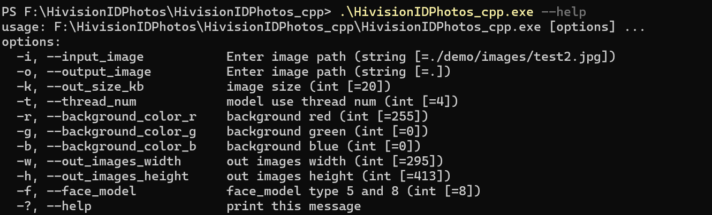

# 						HivisionIDPhoto-cpp


<br>

# 目录


- [项目简介](#项目简介)
- [运行](##运行)
- [Demo启动](#-运行-gradio-demo)
- [Python推理](#-python-推理)
- [API服务部署](#️-部署-api-服务)
- [Docker部署](#-docker-部署)
- [联系我们](#-联系我们)
- [Q&A](#qa)
- [贡献者](#贡献者)
- [感谢支持](#感谢支持)
- [License](#lincese)

<br>


## 项目简介

​	**HivisionIDPhoto 旨在开发一种实用、系统性的证件照智能制作算法。HivisionIDPhoto_cpp是对HivisionIDPhoto C++的重构，目的利用边缘设备的计算资源，以实现嵌入式设备和手机端本地部署。**

**HivisionIDPhoto_cpp可以做到。**

​	**1.离线手机端部署。arm设备部署运行。**

​	**2.轻量级抠图**

​	**3.根据不同尺寸规格生成不同的标准证件照**

​	**4.六寸排版照（waitting）**

​	**5.美颜（waitting）**

​	**6.安卓apk（waitting）**


## 运行


[release](https://github.com/zjkhahah/HivisionIDPhotos_cpp/releases/tag/file)是编译过后的windows版和aarch64版可把执行文件和依赖放入HivisionIDPhotos_cpp根目录下直接执行


### 	**1. 克隆项目**

```
https://github.com/zjkhahah/HivisionIDPhotos_cpp.git
cd  HivisionIDPhotos_cpp
```


### **2.下载权重文件**

存到项目的`model`目录下

modnet_photographic_portrait_matting.mnn [下载](https://github.com/zjkhahah/HivisionIDPhotos-cpp/releases/tag/v1.0/modnet_photographic_portrait_matting.mnn)

hivision_modnet.mnn [下载](https://github.com/zjkhahah/HivisionIDPhotos-cpp/releases/tag/v1.0/mnn_hivision_modnet.mnn)

symbol_10_320_20L_5scales_v2_deploy.mnn[下载](https://github.com/zjkhahah/HivisionIDPhotos-cpp/releases/tag/v1.0/symbol_10_320_20L_5scales_v2_deploy.mnn)

symbol_10_320_20L_8scales_v2_deploy.mnn[下载](https://github.com/zjkhahah/HivisionIDPhotos-cpp/releases/tag/v1.0/symbol_10_320_20L_8scales_v2_deploy.mnn)


### 	**3.编译**

​		**其中MNN版本为2.9.0**

​		**opencv版本为4.7.0**

#### 	**1.windows**

- 环境要求

​		Microsoft Visual Studio >= 2017

​		cmake >= 3.13

​		powershell

​		Ninja

编译MNN库并把编译后的.a静态库文件放入lib文件夹下

编译MNN windows版教程为[主库编译 — MNN-Doc 2.1.1 documentation](https://mnn-docs.readthedocs.io/en/latest/compile/engine.html)

编译opencv windows版.a静态库文件放入lib文件夹下

- 编译代码

​	在设置中找到vcvars64.bat（适用于 VS 2017 的 x64 本机工具命令提示）并单击，打开VS编译x64架构程序的虚拟环境

```
cd  HivisionIDPhotos_cpp
mkdir build && cd build
cmake .. -G Ninja
ninja
```

​	**2.arm64编译**

​	以Linaro工具链为例。首先从[Linaro](https://releases.linaro.org/components/toolchain/binaries/latest-7/)网页中按照宿主机以及交叉编译目标设备来选择合适的工具链。这里我们以`arm-linux-gnueabi`为例，点击网页上的链接，进入[arm-linux-gnueabi](https://releases.linaro.org/components/toolchain/binaries/latest-7/arm-linux-gnueabi/)页面。 按照宿主机类型(这里以X64 Linux为例)选择下载链接, 文件名形如 gcc-linaro-7.5.0-2019.12-x86_64_arm-linux-gnueabi.tar.xz 下载后解压到任意目录

​	编译arm64版本的opencv和mnn

​	编译MNN ARM版教程为[点击这里](https://mnn-docs.readthedocs.io/en/latest/compile/engine.html)

编译好的静态opencv文件和mnn文件放入lib文件夹下

```
cd  HivisionIDPhotos_cpp
mkdir build && cd build
cmake .. \
-DCMAKE_SYSTEM_NAME=宿主系统，例如Linux \
-DCMAKE_SYSTEM_VERSION=1 \
-DCMAKE_SYSTEM_PROCESSOR=交叉编译目标处理器的信息。例如aarch64 \
-DCMAKE_C_COMPILER=交叉编译器中C编译器的路径 \
-DCMAKE_CXX_COMPILER=交叉编译器中C++编译器的路径
make -j8
```


​	**3.使用**

​	以windows为例 powershell打开




## 引用项目

1. [MNN](https://github.com/alibaba/MNN):

```
@software{Alibaba_MNN_2024,
    author = {Alibaba},
    title = {{MNN}},
    url = {https://github.com/alibaba/MNN},
    year = {2024},
    publisher = {GitHub}
}
```

2. [HivisionIDPhotos](https://github.com/Zeyi-Lin/HivisionIDPhotos)

```
@software{Zeyi-Lin_HivisionIDPhotos_2024,
    author = {Zeyi-Lin},
    title = {{HivisionIDPhotos}},
    url = {https://github.com/Zeyi-Lin/HivisionIDPhotos},
    year = {2024},
    publisher = {GitHub}
}
```

3. **[LFFD-MNN](https://github.com/SyGoing/LFFD-MNN)**

```

@software{LFFD-MNN_2024,
    author = {SyGoing},
    title = {{LFFD-MNN}},
    url = {https://github.com/SyGoing/LFFD-MNN},
    year = {2024},
    publisher = {GitHub}
}

```


##  联系我们

如果您有任何问题，请提issue

